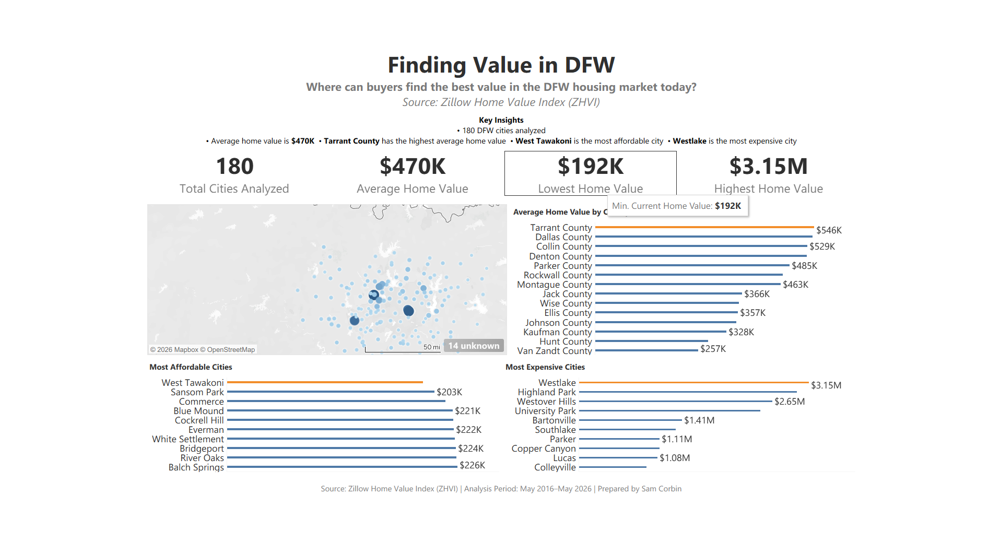
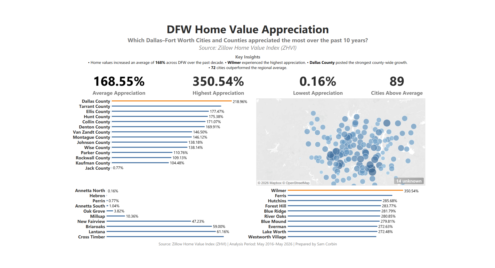
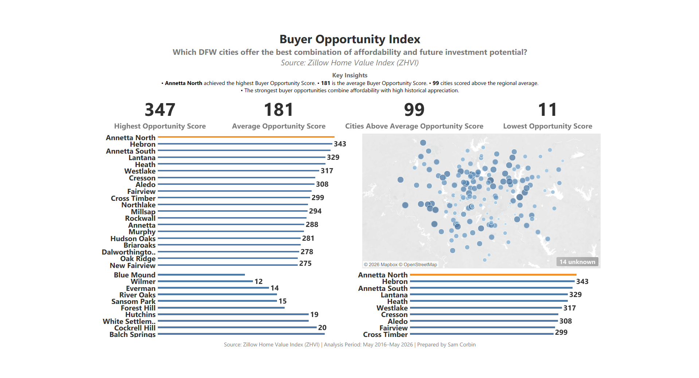

# DFW Housing Market Analysis

**End-to-End Business Intelligence Portfolio Project**

# DFW Housing Market Analysis
End-to-end business intelligence project analyzing 10 years of Dallas–Fort Worth housing market data using SQL, Google BigQuery, Tableau, and Excel

## Project Overview
This project analyzes the Dallas–Fort Worth (DFW) housing market using Zillow Home Value Index (ZHVI) data to identify current market conditions, long-term appreciation trends, and cities offering the strongest buying opportunities.

The analysis combines SQL, BigQuery, Tableau, and Excel to transform raw housing data into interactive dashboards that help buyers, investors, and real estate professionals make data-driven decisions.

The project follows a complete data analytics workflow:

- Data Collection
- Data Cleaning
- SQL Analysis
- Business Intelligence Dashboard Development
- Data Visualization
- Business Recommendations

## Business Problem

Homebuyers and investors often struggle to determine:

- Which cities have appreciated the most over the last decade?
- Which markets remain affordable?
- Which cities offer the strongest balance between affordability and future appreciation?
- Which counties have experienced the strongest housing growth?
- Where should buyers focus today?

This project answers these questions through interactive Tableau dashboards.

## Project Objectives

The objectives of this project were to:

- Analyze current home values across the DFW Metroplex.
- Measure 10-year home value appreciation.
- Compare appreciation across counties and cities.
- Develop a Buyer Opportunity Index combining affordability and appreciation.
- Build interactive dashboards that allow users to explore the market visually.
- Deliver actionable business insights for buyers, investors, and real estate professionals.

## Tools & Technologies

| Tool                               | Purpose                                                         |
| ---------------------------------- | --------------------------------------------------------------- |
| **Google BigQuery (SQL)**          | Data cleaning, transformation, and analysis                     |
| **Tableau**                        | Interactive dashboards and business intelligence visualizations |
| **Microsoft Excel**                | Initial data exploration and validation                         |
| **GitHub**                         | Version control and portfolio hosting                           |
| **Zillow Home Value Index (ZHVI)** | Housing market dataset                                          |

## Dataset

**Source**

Zillow Home Value Index (ZHVI)

The dataset contains housing information for approximately 180 cities across the Dallas–Fort Worth Metroplex, including:

- City
- County
- Current Home Value
- Starting Home Value
- 10-Year Appreciation Percentage
- Buyer Opportunity Score
- Affordability Rank
- Appreciation Rank

## Dashboard Overview

## Dashboard Screenshots

### Dashboard 1 — Current Market Snapshot

Provides a high-level overview of the current DFW housing market, including:

- Average Home Value
- Highest Home Value
- Lowest Home Value
- Cities Above Average
- Average Home Value by County
- Current Home Values by City
- Home Value Bubble Map

---

### Dashboard 2 — Home Value Appreciation

Analyzes historical appreciation over the past decade.

Features include:

- Average Appreciation
- Highest Appreciation
- Lowest Appreciation
- Cities Above Average
- Top Appreciating Cities
- Lowest Appreciating Cities
- County Appreciation
- Appreciation Bubble Map

---

### Dashboard 3 — Buyer Opportunity Index

Identifies cities that offer the strongest combination of affordability and appreciation.

Features include:

- Highest Opportunity Score
- Average Opportunity Score
- Lowest Opportunity Score
- Cities Above Average
- Opportunity Score by City
- Top Buyer Opportunities
- Lowest Opportunity Cities
- Opportunity Bubble Map

## Key Business Insights

### Current Market

- The average home value across the Dallas–Fort Worth Metroplex is approximately **$321K**.
- Dallas County currently has the highest average home values among the counties analyzed.
- More than half of DFW cities have home values above the regional average.

### Historical Appreciation

- Home values appreciated an average of **168.55%** over the past ten years.
- Wilmer experienced the highest appreciation at **350.54%**.
- Eighty-nine cities outperformed the regional average appreciation rate.

### Buyer Opportunity Index

- Annetta North achieved the highest Buyer Opportunity Score.
- Ninety-nine cities scored above the regional average opportunity score.
- Top-ranked cities balance affordability with strong historical appreciation, making them attractive to long-term buyers and investors.

## Business Recommendations

Based on this analysis, several recommendations emerge:

- Prioritize buyer outreach in cities with the highest Buyer Opportunity Scores.
- Monitor rapidly appreciating markets for long-term investment potential.
- Use county-level trends to guide regional marketing strategies.
- Balance affordability and appreciation when advising first-time homebuyers.
- Continue updating the dashboards with new Zillow data to monitor changing market conditions.

## Project Structure

DFW-Housing-Market-Analysis
│
├── Data
│
├── SQL
│
├── Tableau
│
├── Images
│
├── Documentation
│
└── README.md

## Future Improvements

Potential enhancements include:

- Integrating live Zillow API data (if available).
- Adding mortgage rate analysis.
- Incorporating school district ratings.
- Including property tax comparisons.
- Developing predictive home value forecasting models.
- Building a Power BI version for cross-platform comparison.

## Project Summary

This project demonstrates practical experience with:

- SQL
- Google BigQuery
- Tableau
- Excel
- Data Cleaning
- Data Visualization
- KPI Design
- LOD Expressions
- Interactive Dashboards
- Business Intelligence
- Geospatial Analysis
- Analytical Storytelling
